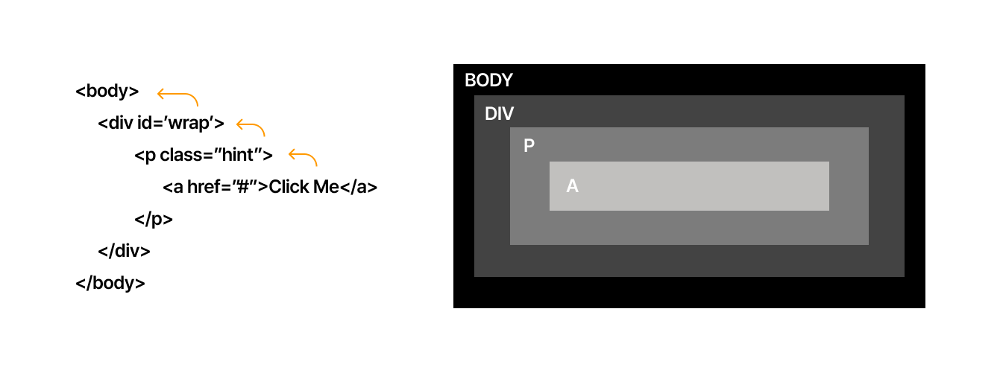
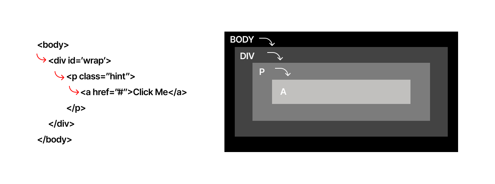

# 이벤트 버블링

버블링(bubbling)의 원리는 간단하다.

한 요소에 이벤트가 발생하면, 요소에 할당된 핸들러가 동작하고, 이어서 부모 요소의 핸들러가 동작하며 전파 합니다. 
이벤트가 제일 깊은 곳에 있는 요소에서 시작해 가장 최상단의 조상 요소를 만날 때까지 이 과정을 반복되면서 요소 각각에 할당된 핸들러가 동작하는데 모양이 마치 물속 거품(bubble)과 닮았기에 버블링이라 지어졌다.



가장 안쪽에 있는 a태그가 클릭됬을 때 4개의 핸들러가 동작합니다.

동작 단계: `<a>` -> `<p>` -> `<div>` -> `<body>`

## 꼭 필용한 경우를 제외하곤 버블링은 막지 마세요

버블링은 유용하다. 버블링을 꼭 멈춰야 하는 명뱍한 상황이 아니라면 버블링을 막으면 안된다. 아키텍쳐를 잘 고려해 진짜 막아야 하는 상황에서만 버블링을 막으면 된다.
`event.stop.Propagation()`은 추후에 문제가 될 수 있는 상황을 만들 수 있다.

문제가 발생할만한 시나리오를 살펴봅니다.

1.  중첩 메뉴를 만들었다 가정합니다. 각 서브메뉴(submenu)에 해당하는 요소에서 클릭 이벤트를 처리하도록 하고, 상위 메뉴의 클릭 이벤트 핸들러는 동작하지 않도록 `stopPropagation`을 적용합니다.
2. 사람들이 페이지에서 어디를 클릭했는지 등의 행동 패턴을 분석하기 위해, window내에서 발생하는 클릭 이벤트 전부를 감지하기로 결정합니다. 일부 분석 시스템은 그렇게 분석합니다. 이런 분석 시스템의 코드는 클릭 이벤트를 감지하기 위해 document.addEventListener('click'…)을 사용합니다.
3. stopPropagation로 버블링을 막아놓은 영역에선 분석 시스템의 코드가 동작하지 않기 때문에, 분석이 제대로 되지 않습니다. 안타깝게도 stopPropagation을 사용한 영역은 '죽은 영역(dead zone)'이 되어버립니다.

> 이벤트 버블링을 막아햐 하는 경우는 거의 없습니다. 버블링을 막아야 해결되는 문제라면 커스텀 이벤트 등을 사용해 문제를 해결할 수 있습니다.

<br />

# 이벤트 캡처링

캡처링은 버블링의 반대입니다. window부터 이벤트가 발생한 요소까지 이벤트를 전파합니다. 실제 코드에서 자주 쓰이지 않지만, 종종 유용한 경우가 있습니다.



위 캡처링 코드입니다. 아래 코드처럼 전체 핸들러에 할당해서 어떤 핸들러가 동작하게 되는지 보여주는 코드입니다.

```JavaScript
for (let elem of document.querySelectorAll("*")) {
        elem.addEventListener(
          "click",
          (e) => alert(`캡쳐링: ${elem.tagName}`),
          true
        );
        elem.addEventListener("click", (e) => alert(`버블링: ${elem.tagName}`));
 }
```

a를 클릭하면 아래의 순서와 같이 이벤트가 전달됩니다.

1. html -> body ->  div -> p(캡처링)
2. a (타깃 단계 | 캡처링과 버블링 둘 다 이벤트 리스너 설정했기에 두 번 호출)
3. p -> div -> body -> html (버블링)


이벤트 캡처링은 기본적으로 비활성화되어 있습니다. 캡처링 단계에서 이벤트를 잡아내려면 `addEventListener()`의 `capture` 옵션을 true 설정해야 합니다.

```JavaScript
elem.addEventListener(..., {capture: true})
// 아니면, 아래 같이 {capture: true} 대신, true를 써줘도 됩니다.
elem.addEventListener(..., true)
```

`capture`옵션은 두 가지 옵션을 가질 수 있습니다.
* `false`이면(default 값) 핸들러는 버블링 단계에서 동작합니다.
* `true`이면 핸들러는 캡처링 단계에서 동작합니다.

<br />

## `target`과 `currentTarget`

부모 요소의 핸들러는 이벤트가 정확히 어디서 발생했는지 등에 대한 자세한 정보를 얻을 수 있스비다.

**이벤트가 발생한 가장 안쪽의 요소는 타깃(target) 요소라고 불리고, `event.target`을 사용해 접근할 수 있습니다.**

`event.target`과 `evet.currentTaeget`(=`this`)는 같은 차이점이 있습니다.
* `event.target`은 실제 이벤트가 시작된 '타깃' 요소입니다. 버블링이 진행되어도 변하지 않습니다.
* `evet.currentTaeget`은 '현재'요소로, 현재 실행 중인 핸들러가 할당된 요소를 참조합니다.

### 예시

핸들러는 `form.onclik`하나밖에 없지만이  핸들러에서 폼 안의 모든 요소에서 발생하는 클릭 이벤트를 **잡아내고** 있습니다. 클릭 이벤트가 어디서 발생했든 상관없이 `<from>`요소까지 이벤트가 버블링 되어 핸들러를 실행시킵니다.

```HTML
  <form id="form">FORM
    <div>DIV
      <p>P</p>
    </div>
  </form>
```

`form.onclick` 핸들러 내의 `event.target`과 `evet.currentTaeget`은 다음과 같습니다.
* `event.currentTarget`(`this`) – `<form>` 요소에 있는 핸들러가 동작했기 때문에 `<form>` 요소를 가리킵니다.
* `event.target` – 폼 안쪽에 실제 클릭한 요소를 가리킵니다.

```JavaScript
form.onclick = function(event) {
  event.target.style.backgroundColor = 'yellow';

  // chrome needs some time to paint yellow
  setTimeout(() => {
    alert("target = " + event.target.tagName + ", this=" + this.tagName);
    event.target.style.backgroundColor = ''
  }, 0);
};
```

`<form>`요소를 클릭했을 때는 `target`과 `currentTarget`이 같습니다

<br />

# 참고 자료

> https://ko.javascript.info/bubbling-and-capturing
> https://developer.mozilla.org/ko/docs/Learn_web_development/Core/Scripting/Event_bubbling
> https://yong-nyong.tistory.com/77